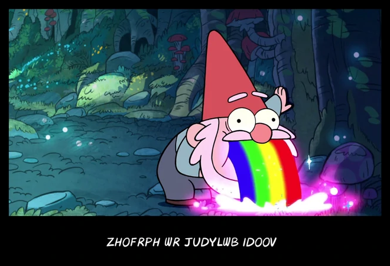

# Caesar Cipher



## Getting started

After cloning the project, execute the following command to make the program available to the CLI:


```sh
npm link
```

## Running it

So far, the program only works with hard coded values.  
Pop open a terminal and run the command below to see it in action:

```sh
caesar-cipher
```

&nbsp;
&nbsp;
&nbsp;

---

Made with :heart: and prog rock :musical_note:
